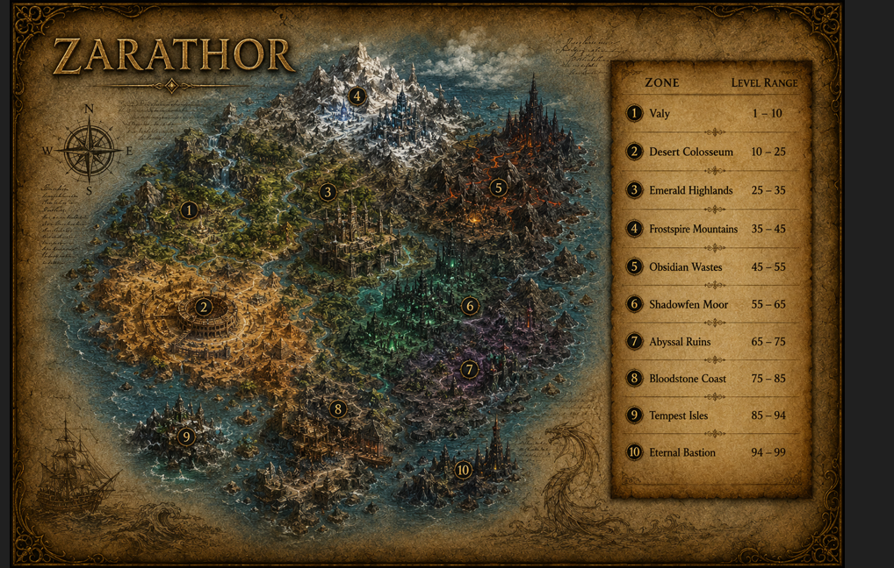
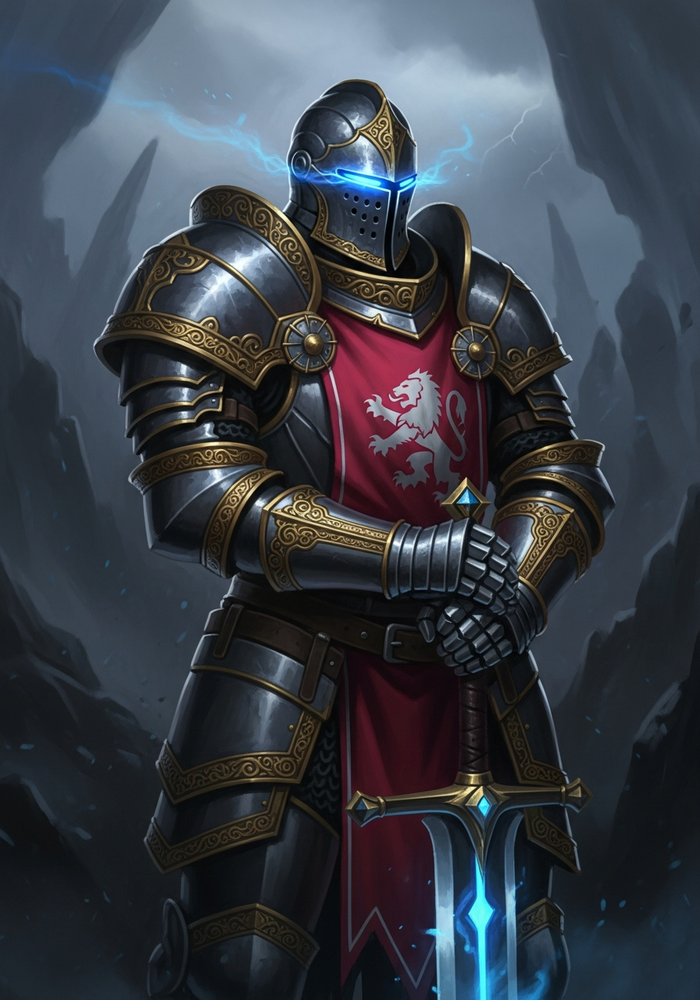
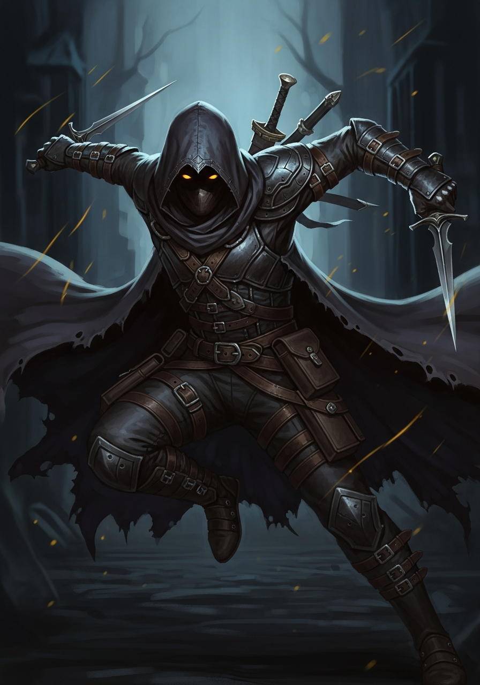
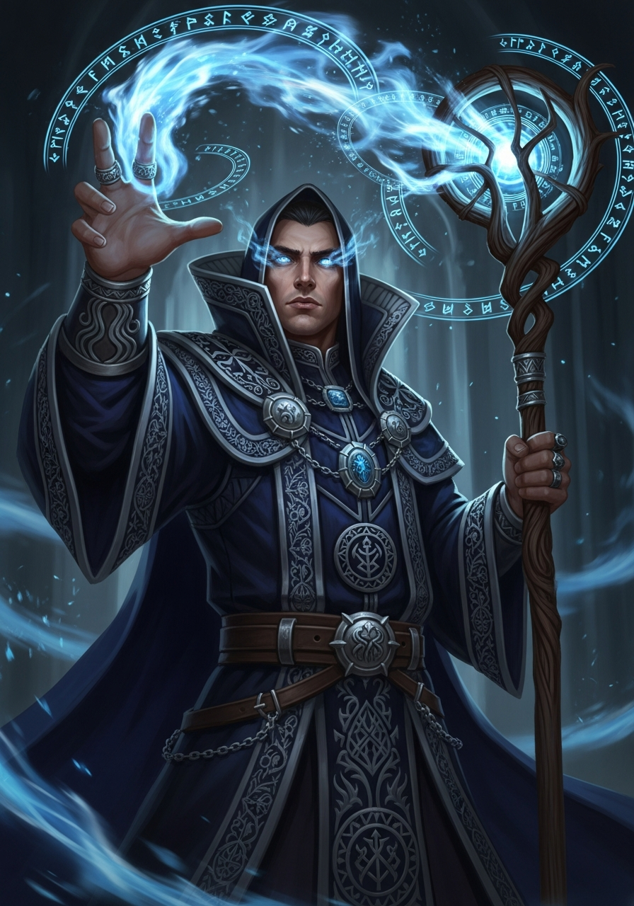
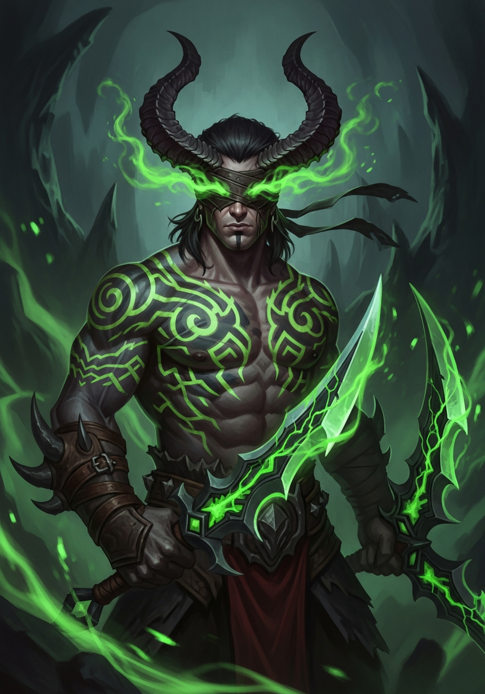

# World of Crypto

A browser-based 2D / 3D fantasy adventure game where heroes and mages explore a living world, battle enemies, and collect rewards. Rendered on an HTML5 Canvas 2D layer with an optional WebGL 3D mode, backed by a lightweight Node.js server and a database for player progress — and powered in-world by the **$WOC** token on Solana.

  

## Features

- 🛡️ **4 Hero Classes** — Knight, Rogue, Mage and Demon Hunter, each with a signature ability, skill bar and talent tree.
- 🪙 **$WOC Token Economy** — the in-game marketplace settles in the $WOC SPL token on Solana, with on-chain price feeds and a player-driven order book.
- 🗺️ **Streamed World** — Four maps (Meadow, Graveyard, Castle, Dungeon) connected by portals, loaded on demand.
- 🎞️ **Animation System** — Sprite-sheet 2D animation plus an optional WebGL 3D path with rigged models, an animation mixer, lighting rig and custom water/terrain shaders.
- 🤖 **AI** — Enemies and bosses driven by finite state machines and A* pathfinding, with multi-phase boss fights.
- ⚔️ **Real-time Combat** — Melee, ranged and spell combat with a pooled particle system.
- 🧑‍🤝‍🧑 **Social** — Parties, guilds, player-to-player trading, channel-based chat and a group finder.
- 🛠️ **Economy** — Crafting recipes, vendors and an auction house.
- 🏆 **Achievements & Leaderboard** — Unlockable achievements and a global ranking.
- 🌍 **124 Global Realms** — 124 sharded realms across 13 geographic regions behind a WebSocket gateway, with latency-based matchmaking, live population heartbeats and per-client rate limiting.
- 💾 **Persistent Progress** — Profiles, inventory, guilds and achievements saved to PostgreSQL via SQL migrations.

## ⚔️ Arenas

Combat arenas where heroes face off:

- 🏟️ **Zini Arena**
- 🌑 **Shadowfall Arena**
- 🦷 **Voidfang Arena**

## The World of Zarathor

The continent of **Zarathor** spans ten level-gated zones, each with its own
biome, enemies and boss:

| # | Zone | Levels |
|---|------|--------|
| 1 | Valy | 1–10 |
| 2 | Desert Colosseum | 10–25 |
| 3 | Emerald Highlands | 25–35 |
| 4 | Frostspire Mountains | 35–45 |
| 5 | Obsidian Wastes | 45–55 |
| 6 | Shadowfen Moor | 55–65 |
| 7 | Abyssal Ruins | 65–75 |
| 8 | Bloodstone Coast | 75–85 |
| 9 | Tempest Isles | 85–94 |
| 10 | Eternal Bastion | 94–99 |



## Hero Classes

Four fully realised classes, each with a signature ability, skill bar and
talent tree. Pick your hero from the launcher:

| | Class | Role | Playstyle |
|---|-------|------|-----------|
|  | **Knight** | Tank | Armored frontline tank. |
|  | **Rogue** | Melee DPS | Fast, deadly melee striker. |
|  | **Mage** | Ranged DPS | Ranged elemental spellcaster. |
|  | **Demon Hunter** | Hybrid DPS | Agile glaive-throwing hybrid. |

## Global Realms

World of Crypto runs **124 sharded realms across 13 geographic regions**
(Americas, Europe, Middle East, Asia Pacific, Oceania and Africa). The gateway
matches each player to the lowest-latency realm, while cross-realm guilds and a
federated leaderboard tie the whole world together.

| Endpoint | Description |
|----------|-------------|
| `GET /api/realms` | Full realm list with live status |
| `GET /api/realms/summary` | Aggregate directory summary (totals, capacity) |
| `GET /api/realms/region/:code` | Realms within one region |
| `GET /api/realms/recommend?region=eu-west` | Recommended low-latency realm |

## Tech Stack

- **Frontend:** HTML5 Canvas, Vanilla JavaScript, CSS3, WebGL (3D layer)
- **Native core:** C++17 simulation engine (physics, A* pathfinding, combat, binary netcode) built with CMake
- **Tooling & AI:** Python 3 — class-balance simulator, loot simulator, procedural map generator, telemetry analysis, autonomous bots and a from-scratch combat-AI neural network
- **Backend:** Node.js, Express
- **Database:** PostgreSQL (player profiles, progress, leaderboard)
- **On-chain:** Solana SPL token ($WOC) — marketplace settlement and treasury

## $WOC Token

World of Crypto's player economy is powered by the **$WOC** SPL token on Solana.
Marketplace trades, premium cosmetics and treasury rewards all settle in $WOC.

| | |
|---|---|
| **Token** | $WOC |
| **Network** | Solana (mainnet-beta) |
| **Standard** | SPL Token |
| **Contract address** | `7iuTToHkV5cdFMXYu4ftMT9obcMgbiRttxF5cXDypump` |
| **Explorer** | [Solscan](https://solscan.io/token/7iuTToHkV5cdFMXYu4ftMT9obcMgbiRttxF5cXDypump) · [pump.fun](https://pump.fun/coin/7iuTToHkV5cdFMXYu4ftMT9obcMgbiRttxF5cXDypump) |

## Marketplace

The in-game marketplace is a player-driven order book settled in $WOC. The
server tracks listings, escrows the item, and releases it once the on-chain
transfer is confirmed.

| Endpoint | Description |
|----------|-------------|
| `GET /api/market/token` | $WOC token metadata (contract, network, decimals) |
| `GET /api/market/listings` | Open listings (filter by `?item=` or `?seller=`) |
| `POST /api/market/list` | List an item for sale, priced in $WOC |
| `POST /api/market/buy` | Buy a listing; returns the settlement intent |
| `GET /api/market/price/:itemId` | Floor / average $WOC price for an item |

## Project Structure

```
world-of-crypto/
├── assets/         # CSS and client-side JS
├── server/         # Express backend + database
├── src/            # Core game engine
├── index.html      # Game entry point
└── package.json
```

## License

MIT © Zeus1020 — see [LICENSE](LICENSE) for details.
